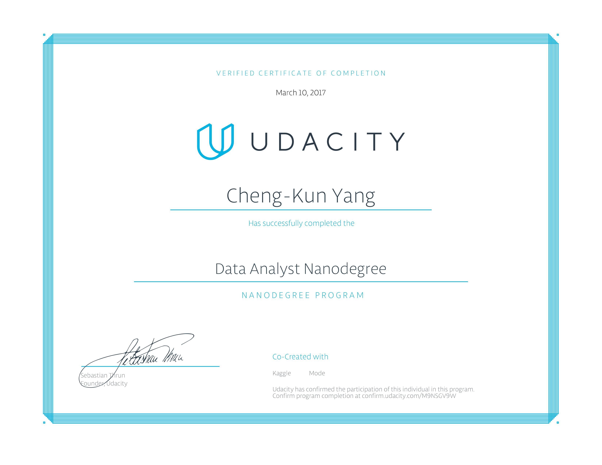

## udacity_data_analyst_nano_degree

I start my data science path by learning skill from this nano degree. I have learn lots of skill to finish a demanding project by myself, including data cleaning, data wragling, data visualizaion, modeling. Here are all the projects list

- Test a Perceptual Phenomenon
- Investigate a Dataset
- Wrangle OpenStreetMap Data
- Explore and Summarize Data
- Identify Fraud from Enron Email
- Make Effective Data Visualization

